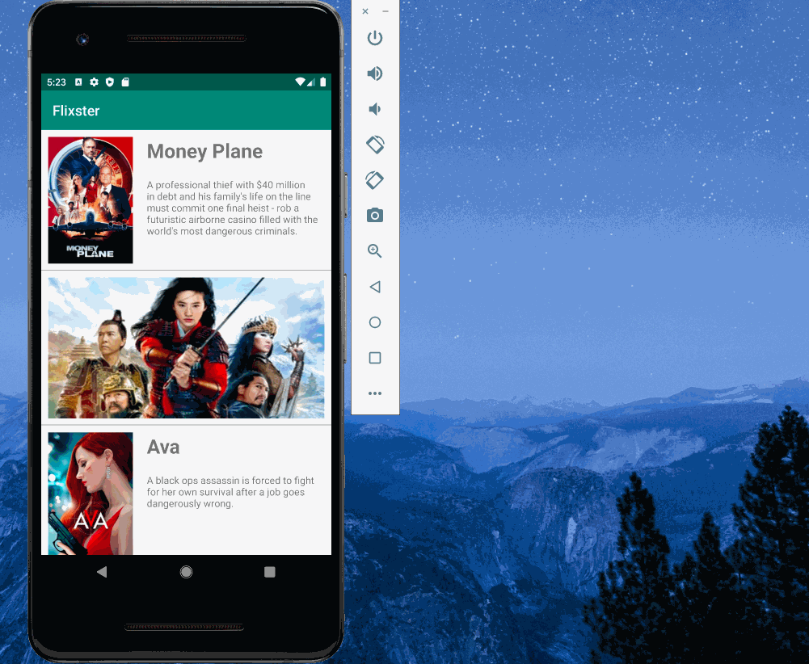

# Flixster

## Flix Part 2

### User Stories

#### REQUIRED (10pts)

- [X] (8pts) Expose details of movie (ratings using RatingBar, popularity, and synopsis) in a separate activity.
- [X] (2pts) Allow video posts to be played in full-screen using the YouTubePlayerView.

#### BONUS

- [X] Trailers for popular movies are played automatically when the movie is selected (1 point).
  - [X] When clicking on a popular movie (i.e. a movie voted for more than 5 stars) the video should be played immediately.
  - [X] Less popular videos rely on the detailed page should show an image preview that can initiate playing a YouTube video.
- [X] Add a play icon overlay to popular movies to indicate that the movie can be played (1 point).
- [X] Apply the data binding library to reduce view boilerplate. (1 point)
- [X] Add a rounded corners for the images using the Glide transformations. (1 point)
- [X] Added shared element transition

### App Walkthough GIF

 

## Open-source libraries used
- [Android Async HTTP](https://github.com/codepath/CPAsyncHttpClient) - Simple asynchronous HTTP requests with JSON parsing
- [Glide](https://github.com/bumptech/glide) - Image loading and caching library for Android

## Flix Part 1

**Flixster** is an android app that displays list of movies and popular movies(movies with rating more than 7).

Submitted by: **Smita Mujumdar**

Time spent: **15** hours spent in total

## User Stories

The following **required** stories are completed:

* [X] User can **view a list of movies (title, poster image, and overview) currently playing in theaters from the Movie Database API.**

The following **stretch** stories are implemented:

* [X] User can **view the poster image, title, and movie overview in the portrait mode.**
* [X] **In landscape mode, the rotated alternate layout should use the backdrop image instead and show the title and movie overview to the right of it.**
* [X] User can **view a default placeholder graphic for each image during loading.**
* [X] **Improve the user interface through styling and coloring**
* [X] **For popular movies, the full backdrop image is displayed. Otherwise, a poster image, the movie title, and overview is listed. Use Heterogenous RecyclerViews and use different ViewHolder layout files for popular movies and less popular ones.**

## Video Walkthrough

Here's a walkthrough of implemented user stories:

GIF created with [LiceCap](http://www.cockos.com/licecap/).

## License

    Copyright [2020] [Smita Mujumdar]

    Licensed under the Apache License, Version 2.0 (the "License");
    you may not use this file except in compliance with the License.
    You may obtain a copy of the License at

        http://www.apache.org/licenses/LICENSE-2.0

    Unless required by applicable law or agreed to in writing, software
    distributed under the License is distributed on an "AS IS" BASIS,
    WITHOUT WARRANTIES OR CONDITIONS OF ANY KIND, either express or implied.
    See the License for the specific language governing permissions and
    limitations under the License.
